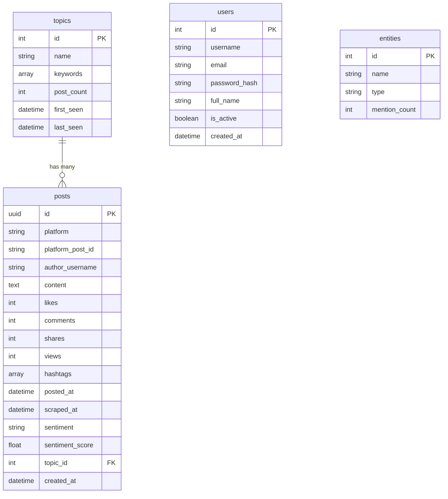

# Database Dictionary & Entity Relationship (PostgreSQL)

Dokumentasi ini menjelaskan struktur skema basis data relasional (PostgreSQL) yang digunakan dalam aplikasi Medallion Data Pipeline. Skema ini dikelola menggunakan SQLAlchemy ORM dan Alembic migrations.

## 1. Tabel: `users`
Tabel untuk menyimpan data otentikasi dan profil admin dashboard.

| Nama Kolom | Tipe Data | Constraint | Deskripsi |
| :--- | :--- | :--- | :--- |
| `id` | Integer | PK, AutoIncrement | Identifier unik untuk pengguna |
| `username` | String(50) | Unique, Not Null | Nama pengguna untuk login |
| `email` | String(255) | Unique, Nullable | Alamat email (opsional) |
| `password_hash` | String(255) | Not Null | Kata sandi yang sudah di-hash (Bcrypt) |
| `full_name` | String(100) | Nullable | Nama lengkap pengguna |
| `is_active` | Boolean | Default(True) | Status aktif akun (Soft Delete) |
| `created_at` | DateTime | Default(Now) | Waktu pembuatan akun |

## 2. Tabel: `topics`
Tabel untuk menyimpan *Trending Topics* hasil klastering/agregasi.

| Nama Kolom | Tipe Data | Constraint | Deskripsi |
| :--- | :--- | :--- | :--- |
| `id` | Integer | PK, AutoIncrement | Identifier unik untuk topik |
| `name` | String(100) | Unique, Not Null | Nama topik (contoh: "#Pilpres2029") |
| `keywords` | Array(Text) | Nullable | Kumpulan kata kunci terkait topik tersebut |
| `post_count` | Integer | Default(0) | Total *tweet/post* yang membicarakan topik ini |
| `first_seen` | DateTime | Nullable | Waktu pertama kali topik ini terdeteksi |
| `last_seen` | DateTime | Nullable | Waktu terakhir kali topik ini dibicarakan |

## 3. Tabel: `entities`
Tabel untuk menyimpan entitas (*Named Entity Recognition*) seperti tokoh, organisasi, atau lokasi. (Disiapkan untuk fitur Knowledge Graph).

| Nama Kolom | Tipe Data | Constraint | Deskripsi |
| :--- | :--- | :--- | :--- |
| `id` | Integer | PK, AutoIncrement | Identifier unik entitas |
| `name` | String(100) | Not Null | Nama entitas (contoh: "Joko Widodo") |
| `type` | String(50) | Not Null | Kategori entitas (`person`, `organization`, `location`) |
| `mention_count` | Integer | Default(0) | Jumlah sebutan entitas ini di seluruh data |

## 4. Tabel: `posts`
Tabel Fakta Utama (Fact Table) yang menyimpan setiap data (cuitan/post) individual yang sudah lolos kurasi.

| Nama Kolom | Tipe Data | Constraint | Deskripsi |
| :--- | :--- | :--- | :--- |
| `id` | UUID | PK, Auto(uuid4) | Identifier internal sistem (Primary Key) |
| `platform` | String(50) | Not Null, **Index** | Sumber data (`x`, `tiktok`, `instagram`) |
| `platform_post_id` | String(100) | Unique, Not Null | ID asli dari platform asal (untuk mencegah duplikasi) |
| `author_username` | String(100) | Not Null | Username pembuat konten |
| `content` | Text | Not Null | Teks utuh dari konten tersebut |
| `likes` | Integer | Default(0) | Jumlah *Likes/Favorites* |
| `comments` | Integer | Default(0) | Jumlah *Replies/Comments* |
| `shares` | Integer | Default(0) | Jumlah *Retweets/Shares* |
| `views` | Integer | Default(0) | Jumlah Penayangan/Views |
| `hashtags` | Array(Text) | Nullable | Daftar tagar yang dipakai |
| `posted_at` | DateTime | Nullable, **Index** | Waktu konten diterbitkan di platform asli |
| `scraped_at` | DateTime | Default(Now) | Waktu konten disedot oleh *Scraper* |
| `sentiment` | String(20) | Nullable, **Index** | Label sentimen AI (`positive`, `negative`, `neutral`) |
| `sentiment_score` | Float | Nullable | Skor probabilitas dari model NLP |
| `topic_id` | Integer | FK(`topics.id`), **Index** | Relasi (Foreign Key) ke tabel `topics` |
| `created_at` | DateTime | Default(Now) | Waktu baris ini disimpan di database |

---

## Entity Relationship Diagram (ERD)

Berikut adalah visualisasi hubungan antar tabel (Data Lineage) di dalam PostgreSQL:

> [!NOTE]
> - Tabel `entities` saat ini berdiri sendiri di SQL, namun disiapkan untuk dihubungkan ke Neo4J Graph Database (menjadi Node dalam Graph) pada tahapan fitur selanjutnya.
> - Telah ditambahkan *Indexing* (B-Tree) pada kolom `posts.platform`, `posts.posted_at`, `posts.sentiment`, dan `posts.topic_id` untuk memastikan performa kueri analitik (*Dashboard* & *Search*) tetap sub-detik (ultra cepat) meskipun data mencapai jutaan baris.
